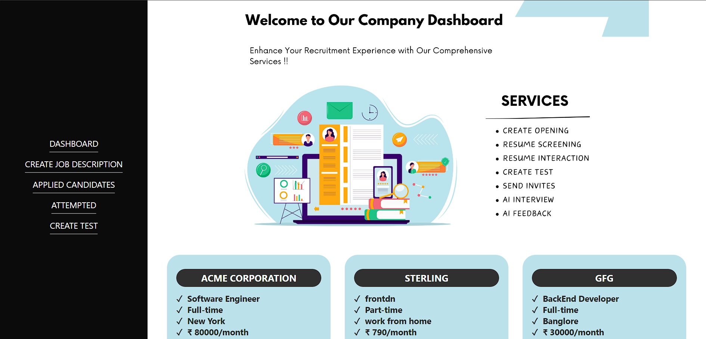
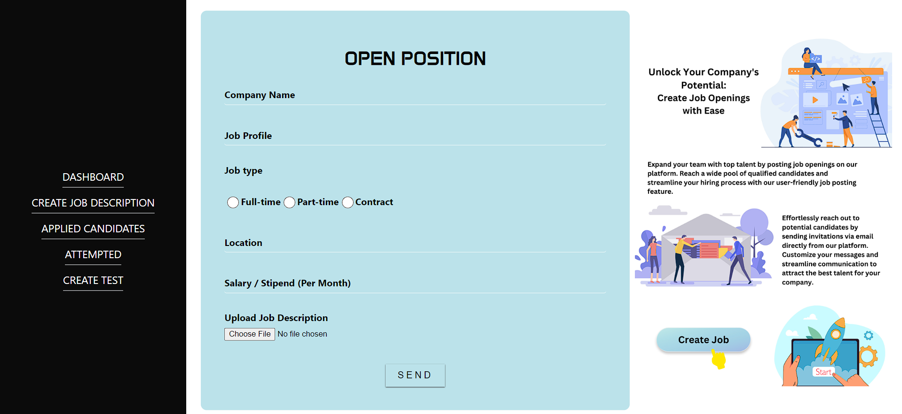
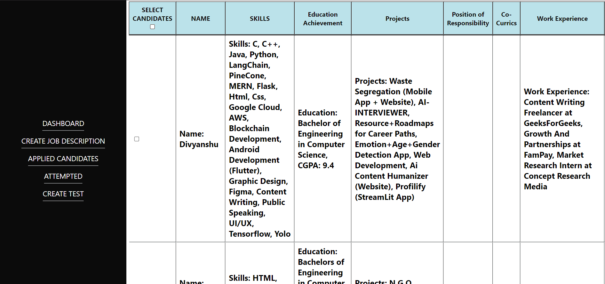
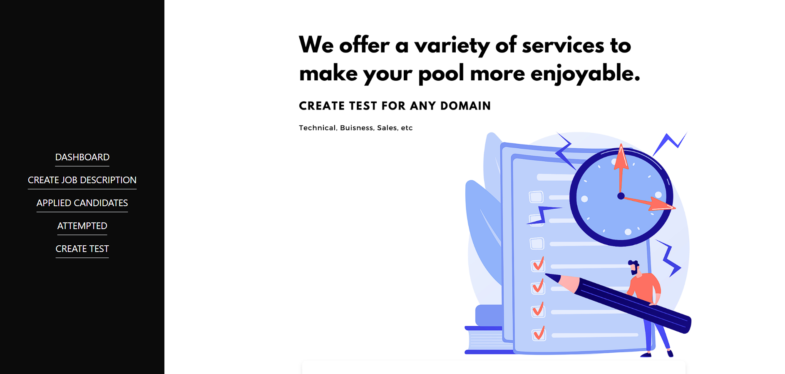

# Company Dashboard for InterviewBot

The Company Dashboard for InterviewBot provides a comprehensive platform for companies to manage their recruitment process efficiently. Companies can create tests, view candidate applications, and access scores for each candidate's test attempt.

## Features

- **Test Creation:** Companies can create customized tests based on their specific requirements and preferred tech stack.
- **Candidate Management:** View all candidate applications received for job openings.
- **Scoreboard:** Access scores and performance metrics for each candidate's test attempt.


## Technologies 

- Node.js
- MongoDB 
- React js
- Express.js

## Installation

1. Clone the repository: 
    ```bash 
   git clone https://github.com/](https://github.com/602dhruviii/CompanyPortalForProfilify.git

## Screenshots and Visual Aids
### Dashboard

### Create Job

### Candidates List

### Create Test


## Credits
* **Project Lead**: *[Dhruvi Trivedi](https://github.com/602dhruviii)*

